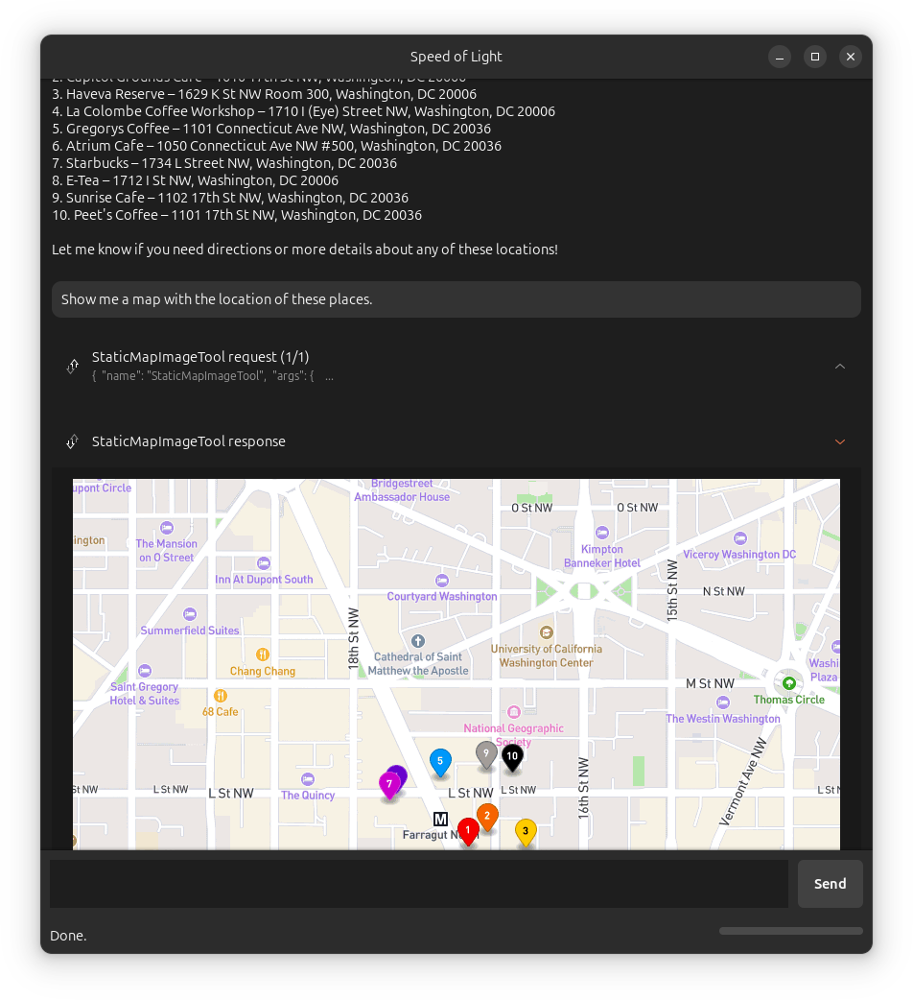

# Speed of Light

Speed of Light (SOL) is a native AI Agent for the Linux desktop.

You can extend its functionality using the [Model Context Protocol](https://modelcontextprotocol.io) (MCP), the USB-C port for AI applications:
<div align="center">
  
  <br><em>Example of SOL running the Mapbox MCP server.</em>
</div>

## Features
- 🏠 Support for both local (default) and cloud LLM providers
- 🔧 Extensible via MCP, supports both STDIO and Streamable HTTP servers
- 🐧 Built-in tools that integrate with the Linux desktop (e.g., clipboard access)
- 🎨 Developed with GNOME Adwaita for a modern look and compatibility with any desktop environment

## Launch the app

Clone this repo, install the dependencies in a virtual environment, and launch the app with Python:

```bash
$ git clone git@github.com:zugaldia/speedoflight.git
$ cd speedoflight
$ python3 -m venv venv
$ source venv/bin/activate
$ pip3 install -r requirements.txt
$ python3 launch.py
```

## Configure the app

SOL uses a `config.toml` file for configuration, stored in the standard location: `~/.config/io.speedoflight.App/`. On first run, if no configuration file exists, SOL will create a default one.

The configuration file uses TOML format and has the following structure:

```toml
llm = "ollama"  # Your preferred provider

[llms.ollama]
model = "mistral-small:latest"

[llms.anthropic]
model = "claude-sonnet-4-0"
api_key = "YOUR-API-KEY-HERE"  # Required for cloud providers

[mcps.example]
type = "stdio"
command = "/path/to/mcp-server"
args = ["--arg1", "value1"]
env = {"ENV_VAR" = "value"}
```

### Configuration Options

- **`llm`**: The LLM provider to use (e.g., `"ollama"`, `"anthropic"`)

- **`[llms.<provider>]`**: Provider-specific configuration sections:
  - For Ollama: `model` specifies the model name (e.g., `"mistral-small:latest"`)
  - For Anthropic: `model` and `api_key` (setting an API key is required), and optionally `enable_web_search` (defaults to `false`) to give Claude direct access to real-time web content with automatic source citations
  - Additional providers coming soon.

- **`[mcps.<server>]`**: Configuration for MCP servers. This allows extending SOL with additional tools. For example, to add the [Mapbox MCP](https://github.com/mapbox/mcp-server) pictured above:

```toml
[mcps.mapbox]
type = "stdio"
command = "npx"
args = ["-y", "@mapbox/mcp-server"]
env = { "MAPBOX_ACCESS_TOKEN" = "YOUR-MAPBOX-ACCESS-TOKEN-HERE" }
```

Or to add the [GNOME MCP Server](https://github.com/bilelmoussaoui/gnome-mcp-server):

```toml
[mcps.gnome]
type = "stdio"
command = "gnome-mcp-server"
```

Streamable HTTP servers are also supported:

```toml
[mcps.everything]
type = "streamable_http"
url = "http://localhost:3001/mcp"
```

Note that MCP servers are optional. SOL can work with no servers configured, in which case you would be talking to the LLM directly without any additional tools.

## Extending the app

To extend SOL's capabilities, you need to make more "tools" available to it. In the current context of LLMs, tools can have different origins and implementations, described below.

We currently support:

- **MCP tools**: This is the primary mechanism to extend the tools available to SOL by a user. MCP is a provider agnostic standard which enables integrating with third-party providers and on-device functionality.
- **Cloud tools**: These are pre-built tools that are provider-specific and executed on the provider's server. They are configured per model and don't require local implementation. Examples include web search tools available from providers like Google, Anthropic, and OpenAI.

We currently do not support, but plan to:

- **Built-in tools**: These are tools defined and implemented by SOL and available together with the other tools above. For example, we include tools that allow SOL to read and write the clipboard content. One possibility is to eventually graduate these built-in tools as their own MCP servers to simplify SOL's architecture and make these tools available to any MCP client.
- **Computer use**: These are also tools that are to some extent provider-specific ([example](https://platform.openai.com/docs/guides/tools-computer-use)), but they do require implementation on SOL's side.

## Reporting Issues

If you encounter any bugs, have feature requests, or need help with Speed of Light, please open an issue on our GitHub repository:

**[Report an Issue](https://github.com/zugaldia/speedoflight/issues)**

When reporting issues, please include:
- Your operating system and version
- The model and configuration you're using
- Steps to reproduce the issue
- Any relevant error messages or logs 
