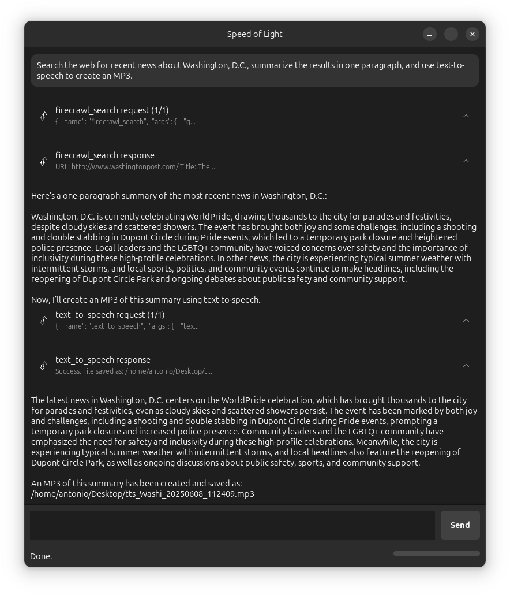

# Speed of Light

Speed of Light (SOL) is a native AI Agent for the Linux desktop:
<div align="center">
  
  <br><em>Example of SOL running the Firecrawl and ElevenLabs MCP servers.</em>
</div>

## Features
- 🏠 Support for both local (default) and cloud providers.
- 🔧 Extensible via [Model Context Protocol](https://modelcontextprotocol.io) (MCP) servers.
- 🐧 Built-in tools that integrate with the Linux desktop (e.g., clipboard access).
- 🎨 Developed with GNOME Adwaita for a modern look and compatibility with any desktop environment.

## Launch the app

Install the dependencies in a virtual environment and launch the app with Python:

```bash
$ python3 -m venv venv
$ source venv/bin/activate
$ pip3 install -r requirements.txt
$ python3 launch.py
```

## Configure the app

SOL uses a `config.json` file for configuration. On first run, if no configuration file exists, SOL will create a default one. You can also create your own by copying the example:

```bash
$ cp config.json.example config.json
```

The configuration file has the following structure:

```json
{
  "model": "ollama:llama3.2",
  "mcp_servers": {},
  "agent_debug": false
}
```

### Configuration Options

- **`model`**: The LLM model to use. Format is `provider:model_name`. Examples:
  - `ollama:llama3.2` (default - requires local Ollama installation)
  - `anthropic:claude-opus-4-20250514` (requires `ANTHROPIC_API_KEY` environment variable)
  - `google_genai:gemini-2.5-pro-preview-06-05` (requires `GOOGLE_API_KEY` environment variable)
  - `openai:gpt-4.1` (requires `OPENAI_API_KEY` environment variable)

- **`agent_debug`**: Enables debug mode in the agent (default: `false`). When enabled, more detailed information will be logged to the terminal, which is useful for troubleshooting.

- **`mcp_servers`**: Configuration for MCP servers. This allows extending the agent with additional tools. For example, to add the Firecrawl MCP so that SOL can download websites and search the web, you would add the following:

```json
{
  ...
  "mcp_servers": {
    "firecrawl": {
      "transport": "stdio",
      "command": "npx",
      "args": ["-y", "firecrawl-mcp"],
      "env": {"FIRECRAWL_API_KEY": "[YOUR_KEY_GOES_HERE]"}
    }
  }
}
```

Note that MCP servers are optional. SOL works with no servers configured (`"mcp_servers": {}`), in which case you would be talking to the LLM directly without any additional tools.

## Extending the app

To extend SOL's capabilities, you need to make more "tools" available to it. In the current context of LLMs, tools can have different origins and implementations, described below.

We currently support:

- **MCP tools**: This is the primary mechanism to extend the tools available to SOL by a user. MCP is a provider agnostic standard which enables integrating with third-party providers and on-device functionality.

- **Built-in tools**: These are tools defined and implemented by SOL and available together with the other tools above. For example, we include two tools that allow SOL to read and send the clipboard content. One possibility is to eventually graduate these built-in tools as their own MCP servers to simplify SOL's architecture and make these tools available to any MCP client. 

We currently do not support, but plan to:

- **Server tools**: These are tools that are provider-specific and are executed on the provider's server. They need to be specified in the request, but they don't require an implementation on SOL's side. One example of such a tool is [web search](https://docs.anthropic.com/en/docs/agents-and-tools/tool-use/web-search-tool), which is available in providers like Google, Anthropic and OpenAI.

- **Computer use**: These are also tools that are to some extent provider-specific ([example](https://platform.openai.com/docs/guides/tools-computer-use)), but they do require implementation on SOL's side. 
